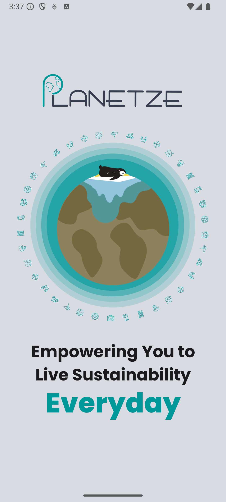
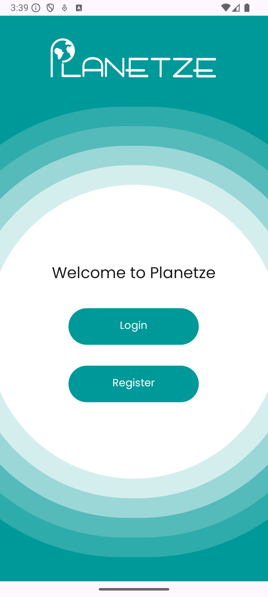
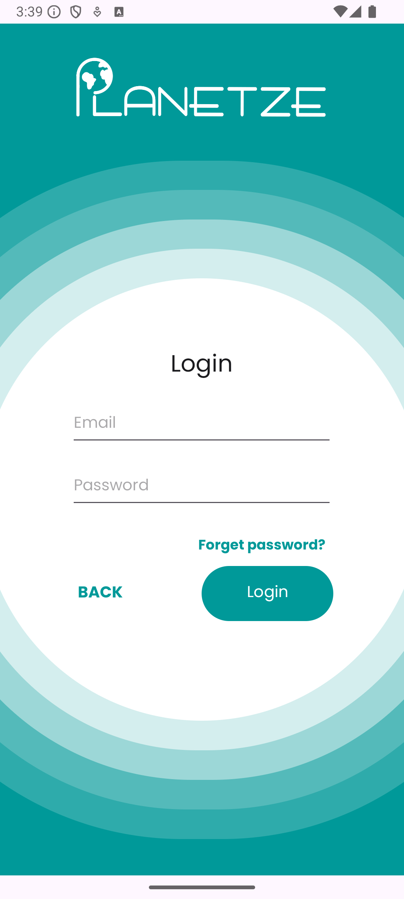
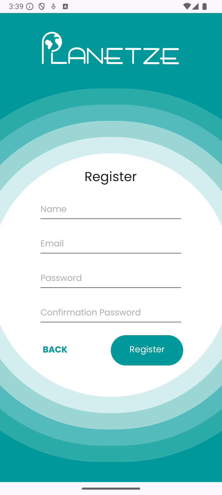

# Planetze

<!-- Not sure whether to add badges -->

## Description
This project is a carbon-tracking Android app that helps users monitor daily carbon emissions from activities like commuting, energy use, and shopping. 
It provides real-time carbon footprint calculations, visual dashboards, and comparisons to regional averages, encouraging users to take simple steps to reduce their carbon footprint.

## Table of Contents
- [Description](#description)
- [Project Overview](#project-overview)
  - [Key Features](#key-features)
  - [App Preview](#app-preview)
- [Installation](#installation)
  - [Prerequisites](#prerequisites)
  - [Building from Source](#building-from-source)
  - [Post-Installation](#post-installation)
- [Folder Structure](#folder-structure)
- [Acknowledgments](#acknowledgments)
- [Technologies Used](#technologies-used)

## Project Overview

Planetze is a sustainability platform designed to empower individuals and employees to track, reduce, and offset their carbon footprint. 
With the rising importance of climate action, Planetze provides users with personalized insights into their environmental impact and offers real-time data on their daily carbon emissions. 
Users can adopt eco-friendly habits, and contribute to certified carbon offset projects, making climate action accessible and achievable for everyone.

### Key Features

**Eco Tracker**: Tracks users' carbon emissions based on their daily activities.  
**Eco Gauge**: A visual representation of progress toward carbon reduction goals, motivating users wit clear, tangible results.  
**Eco Balance**: Provides the users with the ability to offset their carbon emissions.

### App Preview






<!-- TODO -->

## Installation

### Prerequisites
- Android device running Android 5.0 (Lollipop) or higher.
- Android Studio if you want to build the app from source.

### Building from Source
1. Clone the repository:
   ```bash
   git clone https://github.com/danielstevanus88/Planetze
2. Open the project in Android Studio.
3. Sync the Gradle files and ensure all dependencies are resolved.
4. Connect your Android device or set up an emulator.
5. Build and run the app by clicking the **Run** button.

### Post-Installation
- Log in with your credentials or create a new account.
- Explore the app and its features!

## Folder Structure
<!-- TODO -->

<!-- Not sure whether to add license -->

## Acknowledgments
- This is a grouped project for CSCB07H3.
- Contributors: [@Daniel Stevanus](https://github.com/danielstevanus88), [@Muxun Zhang](https://github.com/muxunzzz), [@Tommy Wang](https://github.com/Grimshock1015), [@Helena Zhao](https://github.com/HelenaZhao05), [@Rizky Rajendra Ananta Dewa](https://github.com/RRDewa).

## Technologies Used
- **Java**: For Android app development.
- **Firebase**: For authentication and data storage.
